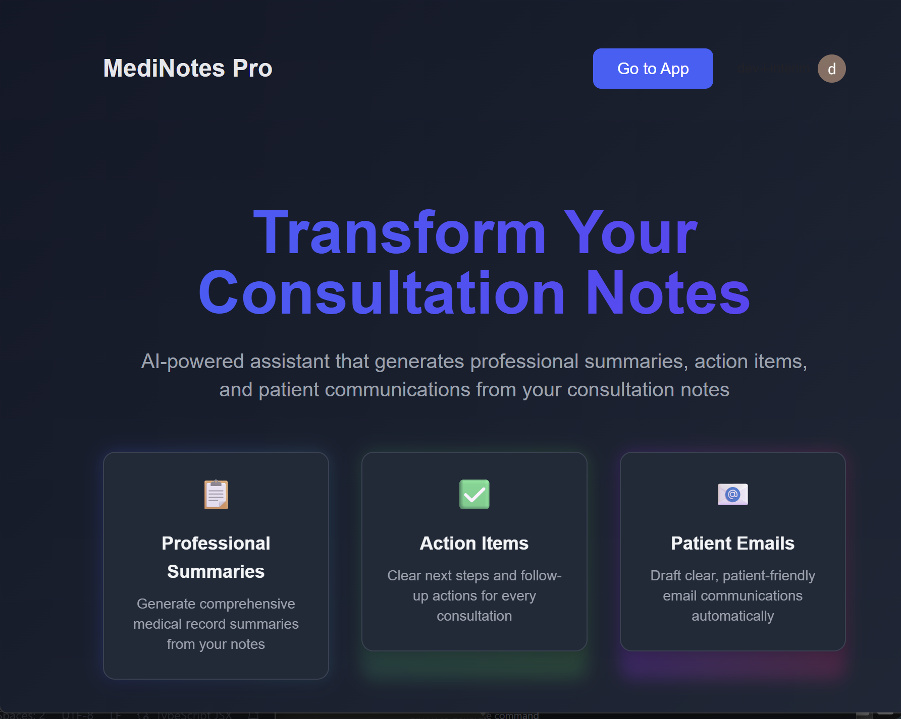

# 🏥 Healthcare Consultation Assistant



> Assistant de consultation médicale alimenté par l'IA — générez des résumés patients, des actions prioritaires et des emails en quelques secondes.

**🔗 Application en production :** [healthcare-consultation-assistant-saas](https://healthcare-consultation-assistant-saas-pdse2wkcp-dev-1a474539.vercel.app/product)

---

## 🇫🇷 Version Française

### Description

**Healthcare Consultation Assistant** est une application SaaS destinée aux professionnels de santé. À partir des notes de consultation d'un médecin, l'application génère automatiquement :

- 📋 Un **résumé professionnel** pour le dossier médical
- ✅ Des **actions prioritaires** pour le médecin
- 📧 Un **email patient** clair et accessible

Le contenu est généré en **temps réel par streaming IA**, avec une authentification sécurisée et un accès réservé aux utilisateurs premium.

---

### 🛠️ Stack Technique

#### Frontend
| Technologie | Rôle |
|---|---|
| Next.js 16 | Framework React fullstack |
| React 19 | Interface utilisateur |
| Tailwind CSS + Typography | Styles |
| Clerk (`@clerk/nextjs`) | Authentification & gestion des abonnements |
| `@microsoft/fetch-event-source` | Streaming SSE temps réel |
| `react-markdown` + `remark-gfm` | Rendu Markdown du contenu généré |
| `react-datepicker` | Sélecteur de date dans le formulaire |

#### Backend
| Technologie | Rôle |
|---|---|
| FastAPI | API REST Python |
| Uvicorn | Serveur ASGI |
| OpenAI SDK | Génération de contenu IA (streaming) |
| Pydantic | Validation des données |
| `fastapi-clerk-auth` | Validation JWT Clerk côté serveur |

#### Déploiement
| Service | Usage |
|---|---|
| Vercel | Déploiement du frontend Next.js |

---

### ✨ Fonctionnalités

- **Formulaire structuré** : Nom du patient, date de consultation, notes du médecin
- **Validation des données** : Schémas Pydantic sur le backend
- **Génération en streaming** : Le contenu IA s'affiche en temps réel caractère par caractère
- **3 sections de sortie** : Résumé médical, liste d'actions, email patient
- **Authentification JWT** : Toutes les requêtes sont sécurisées via Clerk
- **Accès premium** : Fonctionnalité réservée aux abonnés

---

### 🚀 Installation & Lancement en local

#### Prérequis
- Node.js 18+
- Python 3.10+
- Un compte [Clerk](https://clerk.com) (clés API)
- Une clé API [OpenAI](https://platform.openai.com)

#### Backend (FastAPI)

```bash
# Cloner le repo
git clone <url-du-repo>
cd backend

# Créer un environnement virtuel
python -m venv venv
source venv/bin/activate  # Windows : venv\Scripts\activate

# Installer les dépendances
pip install fastapi uvicorn openai fastapi-clerk-auth pydantic

# Variables d'environnement
cp .env.example .env
# Remplir OPENAI_API_KEY, CLERK_SECRET_KEY

# Lancer le serveur
uvicorn main:app --reload
```

#### Frontend (Next.js)

```bash
cd frontend

# Installer les dépendances
npm install

# Variables d'environnement
cp .env.local.example .env.local
# Remplir NEXT_PUBLIC_CLERK_PUBLISHABLE_KEY, CLERK_SECRET_KEY, NEXT_PUBLIC_API_URL

# Lancer en développement
npm run dev
```

L'application est disponible sur `http://localhost:3000`.

---


---

### 🔐 Sécurité & Authentification

- L'authentification est gérée par **Clerk** (OAuth, email/password)
- Chaque requête API embarque un **JWT** vérifié côté serveur par `fastapi-clerk-auth`
- L'accès à l'outil est conditionné par le **statut d'abonnement** de l'utilisateur


---

## 🇬🇧 English Version

### Description

**Healthcare Consultation Assistant** is a SaaS application built for healthcare professionals. From a doctor's consultation notes, the app automatically generates:

- 📋 A **professional summary** for medical records
- ✅ **Actionable next steps** for the doctor
- 📧 A **patient-friendly email** that's easy to understand

Content is generated via **real-time AI streaming**, with secure authentication and access restricted to premium subscribers.

---

### 🛠️ Tech Stack

#### Frontend
| Technology | Role |
|---|---|
| Next.js 16 | React fullstack framework |
| React 19 | UI layer |
| Tailwind CSS + Typography | Styling |
| Clerk (`@clerk/nextjs`) | Authentication & subscription management |
| `@microsoft/fetch-event-source` | Real-time SSE streaming |
| `react-markdown` + `remark-gfm` | Markdown rendering of AI output |
| `react-datepicker` | Date picker in consultation form |

#### Backend
| Technology | Role |
|---|---|
| FastAPI | Python REST API |
| Uvicorn | ASGI server |
| OpenAI SDK | Streaming AI content generation |
| Pydantic | Data validation |
| `fastapi-clerk-auth` | Server-side Clerk JWT validation |

#### Deployment
| Service | Usage |
|---|---|
| Vercel | Next.js frontend deployment |

---

### ✨ Features

- **Structured input form**: Patient name, consultation date, doctor's notes
- **Data validation**: Pydantic schemas on the backend
- **Streaming generation**: AI content renders in real-time, token by token
- **3 output sections**: Medical summary, action items, patient email
- **JWT authentication**: All API requests are secured via Clerk
- **Premium access**: Feature gated to subscribed users only

---

### 🚀 Local Setup

#### Prerequisites
- Node.js 18+
- Python 3.10+
- A [Clerk](https://clerk.com) account (API keys)
- An [OpenAI](https://platform.openai.com) API key

#### Backend (FastAPI)

```bash
# Clone the repo
git clone <repo-url>
cd backend

# Create a virtual environment
python -m venv venv
source venv/bin/activate  # Windows: venv\Scripts\activate

# Install dependencies
pip install fastapi uvicorn openai fastapi-clerk-auth pydantic

# Environment variables
cp .env.example .env
# Fill in OPENAI_API_KEY, CLERK_SECRET_KEY

# Start the server
uvicorn main:app --reload
```

#### Frontend (Next.js)

```bash
cd frontend

# Install dependencies
npm install

# Environment variables
cp .env.local.example .env.local
# Fill in NEXT_PUBLIC_CLERK_PUBLISHABLE_KEY, CLERK_SECRET_KEY, NEXT_PUBLIC_API_URL

# Start development server
npm run dev
```

App available at `http://localhost:3000`.


---

### 🔐 Security & Authentication

- Authentication is handled by **Clerk** (OAuth, email/password)
- Every API request carries a **JWT** that is verified server-side by `fastapi-clerk-auth`
- Access to the tool is gated by the user's **subscription status**

---
